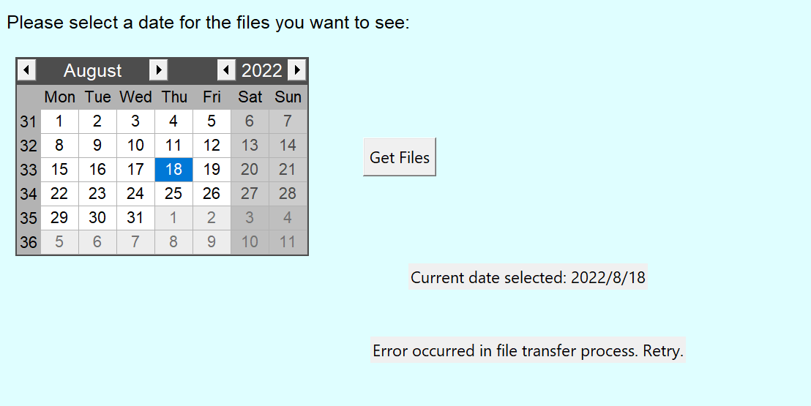
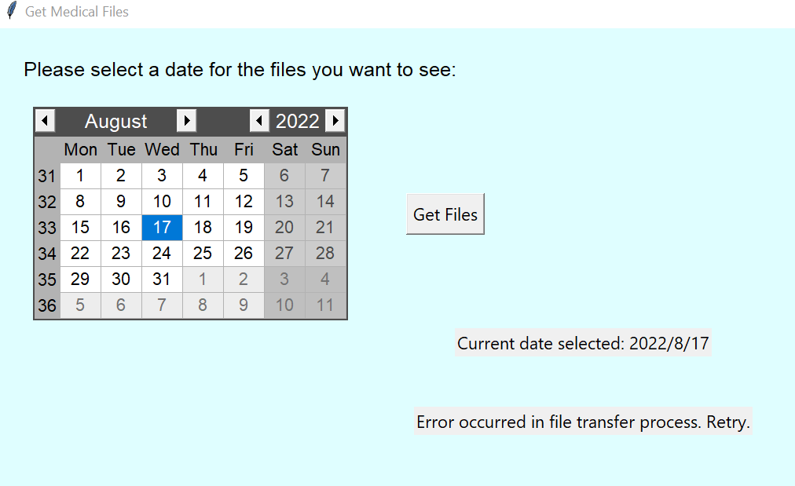
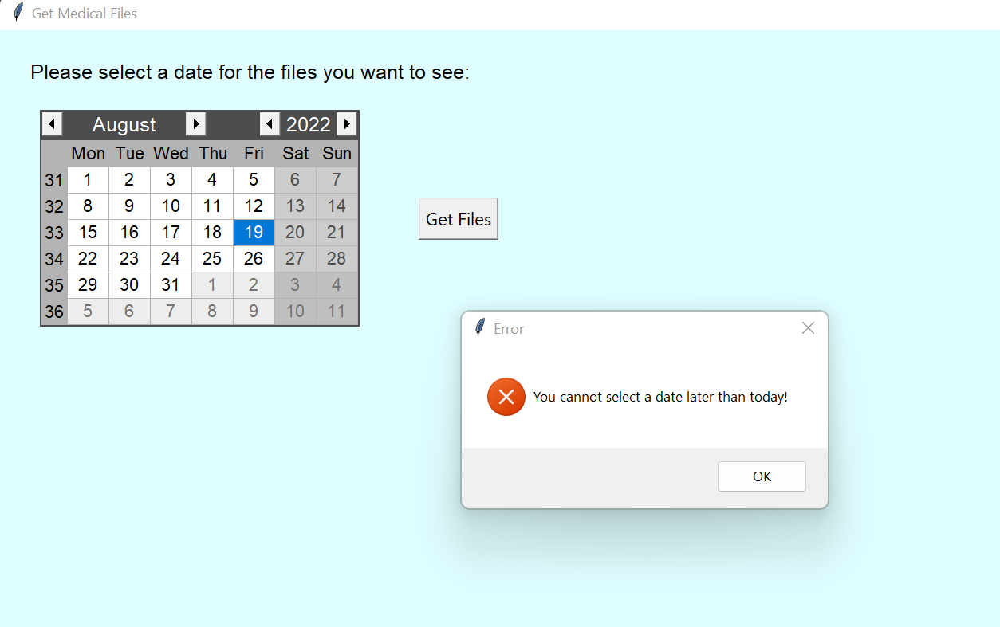

# Test Plan
The below test plans were created and implemented by EmilySJ (EthSpJo)

## validate_file.py:

#### verify_data:

|Test|Inputs|Expected Outcome| pass/fail | links |
|----|------|----------------|-----------|-------|
| test_vd1 | file_data: pandas.read_csv(testDoc1Valid.csv) file_name: testDoc1Valid.csv | True | Passes 16/08/2022 | [Tested code](https://github.com/AnnaD2022/QA-FTP-Project/blob/main/validate_file.py)    [Tested document](https://github.com/AnnaD2022/QA-FTP-Project/blob/main/tests/testDoc1Valid.csv)     [Unit test file](https://github.com/AnnaD2022/QA-FTP-Project/blob/main/test_verify_data.py)|
| test_vd2 | file_data: pandas.read_csv(testDoc2invalid.csv) file_name: testDoc2invalid.csv  | False | Passes 16/08/2022| [Tested code](https://github.com/AnnaD2022/QA-FTP-Project/blob/main/validate_file.py)     [Tested document](https://github.com/AnnaD2022/QA-FTP-Project/blob/main/tests/testDoc2Invalid.csv)    [Unit test file](https://github.com/AnnaD2022/QA-FTP-Project/blob/main/test_verify_data.py)|
| test_vd3 | file_data: pandas.read_csv(testDoc7.3Invalid.csv) file_name: testDoc7.3Invalid.csv  | True |Passes 16/08/2022 | [Tested code](https://github.com/AnnaD2022/QA-FTP-Project/blob/main/validate_file.py)    [Tested document](https://github.com/AnnaD2022/QA-FTP-Project/blob/main/tests/testDoc7.3Invalid.csv)     [Unit test file](https://github.com/AnnaD2022/QA-FTP-Project/blob/main/test_verify_data.py)  |
|test_vd4  | file_data: pandas.read_csv(testDoc7.4Invalid.csv) file_name: testDoc7.4Invalid.csv  | True |Passes 16/08/2022 | [Tested code](https://github.com/AnnaD2022/QA-FTP-Project/blob/main/validate_file.py)    [Tested document](https://github.com/AnnaD2022/QA-FTP-Project/blob/main/tests/testDoc7.4Invalid.csv)     [Unit test file](https://github.com/AnnaD2022/QA-FTP-Project/blob/main/test_verify_data.py) |
|test_vd5 | file_data: pandas.read_csv(testDoc7.51Invalid.csv) file_name: testDoc7.51Invalid.csv  | true| Passes 16/08/2022| [Tested code](https://github.com/AnnaD2022/QA-FTP-Project/blob/main/validate_file.py)    [Tested document](https://github.com/AnnaD2022/QA-FTP-Project/blob/main/tests/testDoc7.51Invalid.csv)     [Unit test file](https://github.com/AnnaD2022/QA-FTP-Project/blob/main/test_verify_data.py) |
|test_vd5.2 | file_data: pandas.read_csv(testDoc7.52Invalid.csv) file_name: testDoc7.52Invalid.csv  | true|Passes 16/08/2022 | [Tested code](https://github.com/AnnaD2022/QA-FTP-Project/blob/main/validate_file.py)    [Tested document](https://github.com/AnnaD2022/QA-FTP-Project/blob/main/tests/testDoc7.52Invalid.csv)     [Unit test file](https://github.com/AnnaD2022/QA-FTP-Project/blob/main/test_verify_data.py) |
|test_vd5.3 | file_data: pandas.read_csv(testDoc7.53Invalid.csv) file_name: testDoc7.53Invalid.csv  | true| Passes 16/08/2022 | [Tested code](https://github.com/AnnaD2022/QA-FTP-Project/blob/main/validate_file.py)    [Tested document](https://github.com/AnnaD2022/QA-FTP-Project/blob/main/tests/testDoc7.53Invalid.csv)     [Unit test file](https://github.com/AnnaD2022/QA-FTP-Project/blob/main/test_verify_data.py) |
|test_vd6  | file_data: pandas.read_csv(testDoc7.6Invalid.csv) file_name: testDoc7.6Invalid.csv | True| Passes 16/08/2022 | [Tested code](https://github.com/AnnaD2022/QA-FTP-Project/blob/main/validate_file.py)    [Tested document](https://github.com/AnnaD2022/QA-FTP-Project/blob/main/tests/testDoc7.6Invalid.csv)     [Unit test file](https://github.com/AnnaD2022/QA-FTP-Project/blob/main/test_verify_data.py)|
|test_vd7  | file_data: pandas.read_csv(testDoc7.71Invalid.csv) file_name: testDoc7.71Invalid.csv  | False | Passes 16/08/2022 | [Tested code](https://github.com/AnnaD2022/QA-FTP-Project/blob/main/validate_file.py)    [Tested document](https://github.com/AnnaD2022/QA-FTP-Project/blob/main/tests/testDoc7.71Invalid.csv)     [Unit test file](https://github.com/AnnaD2022/QA-FTP-Project/blob/main/test_verify_data.py)|
|test_vd7.2  | file_data: pandas.read_csv(testDoc7.72Invalid.csv) file_name: testDoc7.72Invalid.csv  | True | Passes 16/08/2022 | [Tested code](https://github.com/AnnaD2022/QA-FTP-Project/blob/main/validate_file.py)    [Tested document](https://github.com/AnnaD2022/QA-FTP-Project/blob/main/tests/testDoc7.72nvalid.csv)     [Unit test file](https://github.com/AnnaD2022/QA-FTP-Project/blob/main/test_verify_data.py)|

#### check_header:

|Test|Inputs|Expected Outcome| pass/fail | links |
|----|------|----------------|-----------|-------|
|test_ch1 |file_data: pandas.read_csv(testDoc1Valid.csv) file_name: testDoc1Valid.csv | function will return without producing a log file as header values are valid | Pass 12/08/2022   Passes 15/08/2022 (return value check logic added) | [Tested code](https://github.com/AnnaD2022/QA-FTP-Project/blob/main/validate_file.py)    [Tested document](https://github.com/AnnaD2022/QA-FTP-Project/blob/main/tests/testDoc1Valid.csv)     [Unit test file](https://github.com/AnnaD2022/QA-FTP-Project/blob/main/test_check_header.py) |
| test_ch2 | file_data: pandas.read_csv(testDoc2invalid.csv) file_name: testDoc2invalid.csv | A log file with the title 'testDoc2invalid_log.txt' will be created containing the message "Error 200 - Incorrect Header - Errors: replaced reading1 with wrong1, replaced reading7 with wrong7. Header was repaired.", testDoc2invalid.csv will now contain the correct headers| Pass 12/08/2022   Passes 15/08/2022 (return value check logic added)   Passed 16/08/2022 -> name of returned file updated to reflect the change in main code from '_log.txt' to '_info.txt' | [Tested code](https://github.com/AnnaD2022/QA-FTP-Project/blob/main/validate_file.py)    [Tested document](https://github.com/AnnaD2022/QA-FTP-Project/blob/main/tests/testDoc2Invalid.csv)     [Unit test file](https://github.com/AnnaD2022/QA-FTP-Project/blob/main/test_check_header.py) |
| test_ch3 | file_data: pandas.read_csv(testDoc2.1invalid.csv) file_name: testDoc2.1invalid.csv | A log file with the title 'testDoc2.1invalid_log.txt' will be created containing the message "Error 200 - Incorrect Header - Errors: inserted added. Header was repaired.", testDoc2.1invalid.csv will now contain the correct headers| Fails 12/08/2022 - ValueError when attempting to convert the the data with an extra column to the number of columns needed   Passes 15/08/2022 (return value check logic added and handling of a ValueError implemented in verify_file code)   Passed 16/08/2022 -> name of returned file updated to reflect the change in main code from '_log.txt' to '_info.txt' | [Tested code](https://github.com/AnnaD2022/QA-FTP-Project/blob/main/validate_file.py)     [Tested document](https://github.com/AnnaD2022/QA-FTP-Project/blob/main/tests/testDoc2.1Invalid.csv)     [Unit test file](https://github.com/AnnaD2022/QA-FTP-Project/blob/main/test_check_header.py) |
| test_ch4 | file_data: pandas.read_csv(testDoc3InvalidRC.csv) file_name: testDoc3InvalidRC.csv | A log file with the title 'testDoc3InvalidRC_log.txt' will be created containing the message "Error 200 - Incorrect Header - Errors: deleted reading6. Header was repaired.", testDoc3InvalidRC.csv will now contain the correct headers| Pass - 12/08/2022   Passes 15/08/2022 (return value check logic added)   Passed 16/08/2022 -> name of returned file updated to reflect the change in main code from '_log.txt' to '_info.txt' | [Tested code](https://github.com/AnnaD2022/QA-FTP-Project/blob/main/validate_file.py)    [Tested document](https://github.com/AnnaD2022/QA-FTP-Project/blob/main/tests/testDoc3InvalidRC.csv)     [Unit test file](https://github.com/AnnaD2022/QA-FTP-Project/blob/main/test_check_header.py) |

#### remove_empty:

|Test|Inputs|Expected Outcome| pass/fail | links |
|----|------|----------------|-----------|-------|
|test_re1 |file_data: pandas.read_csv(testDoc1Valid.csv) file_name: testDoc1Valid.csv | function will return False without producing a log file| Passes 12/08/2022 | [Tested code](https://github.com/AnnaD2022/QA-FTP-Project/blob/main/validate_file.py)     [Tested document](https://github.com/AnnaD2022/QA-FTP-Project/blob/main/tests/testDoc1Valid.csv)     [Unit test file](https://github.com/AnnaD2022/QA-FTP-Project/blob/main/test_remove_empty.py) |
| test_re2 | file_data: pandas.read_csv(testDoc2invalid.csv) file_name: testDoc2invalid.csv |  A log file with the title 'testDoc2invalid_log.txt' will be created containing the message "Error 300 - Missing Values - Column 2 Row 7. Column 5 Row 5. Column 8 Row 10.", True will be returned.| Passes 12/08/2022   Passed 16/08/2022, check of return value in the instance of an invalid file added and name of returned file to check against modified to reflect change in code.| [Tested code](https://github.com/AnnaD2022/QA-FTP-Project/blob/main/validate_file.py)     [Tested document](https://github.com/AnnaD2022/QA-FTP-Project/blob/main/tests/testDoc2Invalid.csv)    [Unit test file](https://github.com/AnnaD2022/QA-FTP-Project/blob/main/test_remove_empty.py) |

#### check_num_rows:

|Test|Inputs|Expected Outcome| pass/fail | links |
|----|------|----------------|-----------|-------|
| test_cnr1 |file_data: pandas.read_csv(testDoc1Valid.csv) file_name: testDoc1Valid.csv | function will return False without producing a log file| Passes 12/08/2022 | [Tested code](https://github.com/AnnaD2022/QA-FTP-Project/blob/main/validate_file.py)     [Tested document](https://github.com/AnnaD2022/QA-FTP-Project/blob/main/tests/testDoc1Valid.csv)     [Unit test file](https://github.com/AnnaD2022/QA-FTP-Project/blob/main/test_row_num.py)|
| test_cnr2 | file_data: pandas.read_csv(testDoc3InvalidRC.csv) file_name: testDoc3InvalidRC.csv |A log file with the title 'testDoc3InvalidRC_log.txt' will be created containing the message "Error 400 - Incorrect Number of Rows - 9 rather than 10", True will be returned| Passes 12/08/2022    Passed 16/08/2022, check of return value in the instance of an invalid file added and name of returned file to check against modified to reflect change in code.| [Tested code](https://github.com/AnnaD2022/QA-FTP-Project/blob/main/validate_file.py)     [Tested document](https://github.com/AnnaD2022/QA-FTP-Project/blob/main/tests/testDoc3InvalidRC.csv)    [Unit test file](https://github.com/AnnaD2022/QA-FTP-Project/blob/main/test_row_num.py) |

#### check_ids:

|Test|Inputs|Expected Outcome| pass/fail | links |
|----|------|----------------|-----------|-------|
| test_cid1 |file_data: pandas.read_csv(testDoc1Valid.csv) file_name: testDoc1Valid.csv | function will return False without producing a log file| Passed 12/08/2022 | [Tested code](https://github.com/AnnaD2022/QA-FTP-Project/blob/main/validate_file.py)     [Tested document](https://github.com/AnnaD2022/QA-FTP-Project/blob/main/tests/testDoc1Valid.csv)     [Unit test file](https://github.com/AnnaD2022/QA-FTP-Project/blob/main/test_check_ids.py)|
| test_cid2| file_data: pandas.read_csv(testDoc4DupBID.csv) file_name: testDoc4DupBID.csv | A log file with the title 'testDoc4DupBID_log.txt' will be created containing the message "Error 500 - Invalid Batch ID - Duplicate ID 107", True will be returned | Passes 12/08/2022  Passed 13/08/2022 - checking returned value logic added   Passed 16/08/2022 - name of returned file altered to match the change in main code from '_log.txt' to '_info.txt' | [Tested code](https://github.com/AnnaD2022/QA-FTP-Project/blob/main/validate_file.py)    [Tested document](https://github.com/AnnaD2022/QA-FTP-Project/blob/main/testDoc4DupBID.csv)     [Unit test file](https://github.com/AnnaD2022/QA-FTP-Project/blob/main/tests/test_check_ids.py)|
| test_cid3| file_data: pandas.read_csv(testDoc4NegBID.csv) file_name: testDoc4NegBID.csv | A log file with the title 'testDoc4NegBID_log.txt' will be created containing the message "Error 500 - Invalid Batch ID - Negative ID -9", True will be returned | Passes 12/08/2022   Passed 13/08/2022 - checking returned value logic added   Passed 16/08/2022 - name of returned file altered to match the change in main code from '_log.txt' to '_info.txt' | [Tested code](https://github.com/AnnaD2022/QA-FTP-Project/blob/main/validate_file.py)     [Tested document](https://github.com/AnnaD2022/QA-FTP-Project/blob/main/testDoc4NegBID.csv)     [Unit test file](https://github.com/AnnaD2022/QA-FTP-Project/blob/main/tests/test_check_ids.py)|
| test_cid4| file_data: pandas.read_csv(testStr4DupBID.csv) file_name: testDoc4StrBID.csv | A log file with the title 'testDoc4StrBID_log.txt' will be created containing the message "Error 500 - Invalid data type 'string'", True will be returned | Passes 12/08/2022   Passed 13/08/2022 - checking returned value logic added   Passed 16/08/2022 - name of returned file altered to match the change in main code from '_log.txt' to '_info.txt'| [Tested code](https://github.com/AnnaD2022/QA-FTP-Project/blob/main/validate_file.py)     [Tested document](https://github.com/AnnaD2022/QA-FTP-Project/blob/main/tests/testDoc4StrBID.csv)     [Unit test file](https://github.com/AnnaD2022/QA-FTP-Project/blob/main/test_check_ids.py)|

#### check_timestamp:

|Test|Inputs|Expected Outcome| pass/fail | links |
|----|------|----------------|-----------|-------|
| test_cts1 |file_data: pandas.read_csv(testDoc1Valid.csv) file_name: testDoc1Valid.csv | function will return False without producing a log file| Pass 12/08/2022 | [Tested code](https://github.com/AnnaD2022/QA-FTP-Project/blob/main/validate_file.py)     [Tested document](https://github.com/AnnaD2022/QA-FTP-Project/blob/main/tests/testDoc1Valid.csv)     [Unit test file](https://github.com/AnnaD2022/QA-FTP-Project/blob/main/test_timestamp.py)|
| test_cts2| file_data: pandas.read_csv(testDoc5InvalidTS.csv) file_name: testDoc5InvalidTS.csv| A log file with the name: testDoc5InvalidTS_log.txt will be created containing the message "Error 700 - Incorrect Timestamp -\ 20-20-20 \ on line 11" | Passed 12/08/2022   Passed 16/08/2022, check of return value in the instance of an invalid file added and name of returned file to check against modified to reflect change in code. | [Tested code](https://github.com/AnnaD2022/QA-FTP-Project/blob/main/validate_file.py)    [Tested document](https://github.com/AnnaD2022/QA-FTP-Project/blob/main/testDoc5InvalidTS.csv)     [Unit test file](https://github.com/AnnaD2022/QA-FTP-Project/blob/main/tests/test_timestamp.py)|

#### check_readings:

|Test|Inputs|Expected Outcome| pass/fail | links |
|----|------|----------------|-----------|-------|
| test_cr1 |file_data: pandas.read_csv(testDoc1Valid.csv) file_name: testDoc1Valid.csv | function will return False without producing a log file| Fails 12/08/2022 - valid reading values not adequately recognised.   Passed 13/08/2022, check of type of values read in from csv file modified to reflect the correct type | [Tested code](https://github.com/AnnaD2022/QA-FTP-Project/blob/main/validate_file.py)     [Tested document](https://github.com/AnnaD2022/QA-FTP-Project/blob/main/testDoc1Valid.csv)     [Unit test file](https://github.com/AnnaD2022/QA-FTP-Project/blob/main/test_check_readings.py)|
| test_cr2 | file_data: pandas.read_csv(testDoc6.1notfloar.csv) file_name: testDoc6.1notfloar.csv | A log file with the name: 'testDoc6.1notfloar_log.txt' will be created containing the message: "Error 800 -Int, Not Float, row 3 column 5. Cast as float, Error 801 - Incorrect Data Type row 4 column 5" True will then we returned| Passed 12/08/2022   Passed 16/08/2022 - name of returned file altered to match the change in main code from '_log.txt' to '_info.txt'| [Tested code](https://github.com/AnnaD2022/QA-FTP-Project/blob/main/validate_file.py)     [Tested document](https://github.com/AnnaD2022/QA-FTP-Project/blob/main/tests/testDoc6.1notfloar.csv)    [Unit test file](https://github.com/AnnaD2022/QA-FTP-Project/blob/main/test_check_readings.py)|
| test_cr3 | file_data: pandas.read_csv(testDoc6.2RangeDP.csv) file_name: testDoc6.2RangeDP.csv.csv | A log file with the name: 'testDoc6.2RangeDPr_log.txt' will be created containing the message: "Error 802 - Incorrect Rounding: 6.162783 row 5 Column 5, Error 803 - Value Out of Range - 90.341 row 11 column 3" True will then we returned| Passed 12/08/2022   Passed 16/08/2022 - name of returned file altered to match the change in main code from '_log.txt' to '_info.txt'| [Tested code](https://github.com/AnnaD2022/QA-FTP-Project/blob/main/validate_file.py)    [Tested document](https://github.com/AnnaD2022/QA-FTP-Project/blob/main/tests/testDoc6.2RangeDP.csv)    [Unit test file](https://github.com/AnnaD2022/QA-FTP-Project/blob/main/test_check_readings.py)|

## main.py
This script creates the GUI and validates the date selected by the user thus these tests will focus on ensuring the correct messages, etc are displayed.
 
|Test|Inputs|Expected Outcome| pass/fail | links |
|----|------|----------------|-----------|-------|
| test_m1 | Selection of todays date in presented calendar (18/08/2022) | Message box 'current date selected 22/8/18', another message box indicating the number of successfully downloaded files or that there was an issue in download will also be shown | Passed 18/08/2022    | [Tested code](https://github.com/AnnaD2022/QA-FTP-Project/blob/main/main.py)   [Unit test file](https://github.com/AnnaD2022/QA-FTP-Project/blob/main/tests_main.py) |
| test_m2 | Selection of yesterdays date in presented calendar (22/8/17) | Message box 'current date selected 17/08/2022', another message box indicating the number of successfully downloaded files or that there was an error in download will also be shown| Passed 18/08/2022    | [Tested code](https://github.com/AnnaD2022/QA-FTP-Project/blob/main/main.py)   [Unit test file](https://github.com/AnnaD2022/QA-FTP-Project/blob/main/tests_main.py)  |
| test_m3 | Selection of tomorrows date in presented calendar (19/08/2022)| Message box: Error", "You cannot select a date later than today! | test failed 18/08/2022 -> incorrect definition of 'messagebox' in main.py lead to error generation when you attempted to select tomorrow date    test passed 18/08/2022 -> 'from tkinter import message box' added to main.py to enable message box to be displayed.    | [Tested code](https://github.com/AnnaD2022/QA-FTP-Project/blob/main/main.py)     [Unit test file](https://github.com/AnnaD2022/QA-FTP-Project/blob/main/tests_main.py) |

## client.py
#### download_files:
|Test|Inputs|Expected Outcome| pass/fail | links |
|----|------|----------------|-----------|-------|
| test_cl1 | 2022,8,17 | the number of files pertaining to this day should be returned - return val should not be -1 | Passed 18/08/2022 | [Tested code](https://github.com/AnnaD2022/QA-FTP-Project/blob/main/client.py)    [Code that must also be running for these tests to pass](https://github.com/AnnaD2022/QA-FTP-Project/blob/main/server.py)     [Unit test file](https://github.com/AnnaD2022/QA-FTP-Project/blob/main/test_client.py) |
| test_cl2| function argument input:2022,8,17   Additionally, the user parameter is changed to 'bob' | -1 returned | Passed 18/08/2022 | [Tested code](https://github.com/AnnaD2022/QA-FTP-Project/blob/main/client.py)    [Code that must also be running for these tests to pass](https://github.com/AnnaD2022/QA-FTP-Project/blob/main/server.py)     [Unit test file](https://github.com/AnnaD2022/QA-FTP-Project/blob/main/test_client.py)|
|test_cl3 | function argument input:2022,8,17   Additionally, the password parameter is changed to 'tempPassword' | -1 returned |Passed 18/08/2022 |[Tested code](https://github.com/AnnaD2022/QA-FTP-Project/blob/main/client.py)    [Code that must also be running for these tests to pass](https://github.com/AnnaD2022/QA-FTP-Project/blob/main/server.py)     [Unit test file](https://github.com/AnnaD2022/QA-FTP-Project/blob/main/test_client.py) | 
|test_cl4 | 2023,8,17 | '0' should be returned (although this is an invalid date, this function assumes that only valid dates are being passed in.) | Passed 18/08/2022 | [Tested code](https://github.com/AnnaD2022/QA-FTP-Project/blob/main/client.py)    [Code that must also be running for these tests to pass](https://github.com/AnnaD2022/QA-FTP-Project/blob/main/server.py)     [Unit test file](https://github.com/AnnaD2022/QA-FTP-Project/blob/main/test_client.py) |